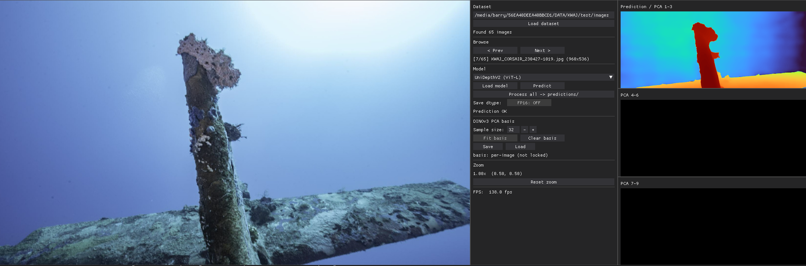
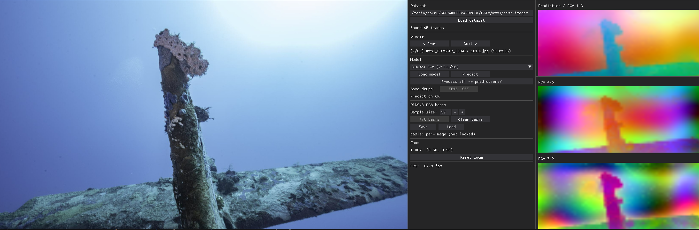
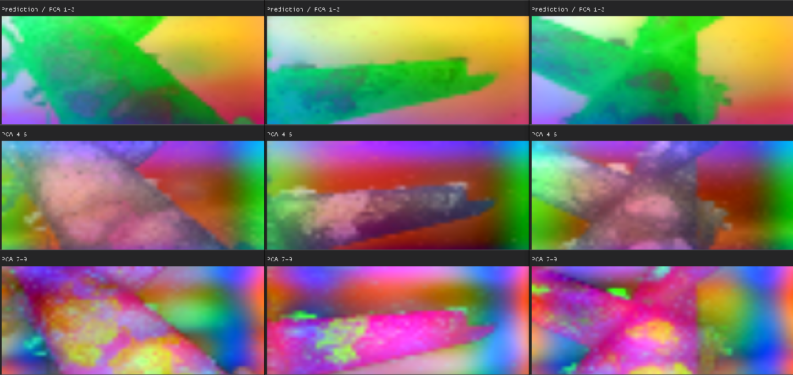
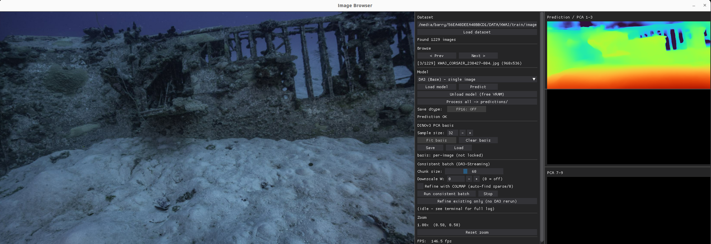

# Viewer + DataProcessing for Various DeepLearning Models
An interface for inference and automated dataset processing.

Core Features:
- Automate depth estimation over a large dataset
- View and assess the model being interfaced
- Save torch `.pth` with option for `fp16` for faster loading downstream

Viewer Features:
- Unified Drag & Zoom across all renders
- (dinov3) Predict a feature basis (PCA) for rendering view-consistent features for multi-view datasets
- (dinov3) Save and Load feature basis

# Viewer Samples

## For UniDepth
Depth estimate example:


## For DINOv3
Generic PCA Features


View-Consistent PCA Features


## For DepthAnythingv3
Depth estimate:


## Control Panel
The control panel includes:
1. Load image folder by path
2. Browsing controls
3. Model selection with
    1. Loading/Unloading models
    2. Saving `fp16` for compactness
    3. Propagate predictions for every image
4. DINOv3 basis generation with
    1. Basis shape control 
    2. Save/Load Basis from dataset
5. DepthAnythingv3 streaming controls
    1. Chunk/window size (as DAv3 does not work efficiently on long high-res videos)
    2. Image downscaling factor
    3. Option for depth refinement with COLMAP inputs
    4. Run/Refine the predictions
5. Viewing/Reset the zoom
6. Viewing the FPS


# Installation

This was tested on Linux with an RTX3090 and Cuda 12.4.

```
conda env create -f environment.yml
conda activate DLviewer

# For UniDepth V2 from root
git clone https://github.com/lpiccinelli-eth/UniDepth.git
cd UniDepth/
pip install -e .
python ./scripts/demo.py

## Possible solution to issue with libstdc++.so
export LD_LIBRARY_PATH=$CONDA_PREFIX/lib:$LD_LIBRARY_PATH

# For Dinov3 from root
git clone https://github.com/facebookresearch/dinov3
cd dinov3
pip install -e .

## You will need to wget the checkpoints and place then in `checkpoints/` for the vit s, b and l models 

# For Depth-Anything-3 from root
git clone https://github.com/ByteDance-Seed/Depth-Anything-3.git --recursive
cd Depth-Anything-3
pip install -e .

## You will also need to install the Depth-Anything-3/da3_streaming/` dependency for finetuning COLMAP poses and refining the initial point cloud

```

# Run and Downstream Use
Run with

```
python gui_utils/base.py
```

To load the images efficiently onto the GPU in downstream applications, use:
```
torch.load(path, map_location='cuda', weights_only=True)
```