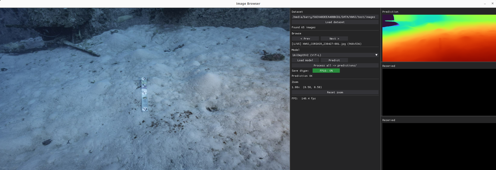
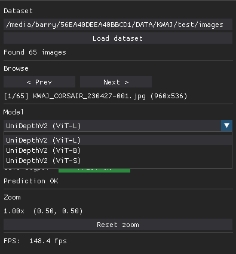

# Viewer + DataProcessing for Various DeepLearning Models
An interface for inference and automated dataset processing.

Core Features:
- Automate depth estimation over a large dataset
- View and assess the model being interfaced
- Save torch `.pth` with option for `fp16` for faster loading downstream

Viewer Features:
- Unified Drag & Zoom across all renders 




# Installation

This was tested on Linux with an RTX3090 and Cuda 12.4.

```
conda env create -f environment.yml
conda activate DLviewer

# For UniDepth V2
git clone https://github.com/lpiccinelli-eth/UniDepth.git
cd UniDepth/
pip install -e .
python ./scripts/demo.py

## Possible solution to issue with libstdc++.so
export LD_LIBRARY_PATH=$CONDA_PREFIX/lib:$LD_LIBRARY_PATH

```

# Run and Downstream Use
Run with

```
python gui_utils/base.py
```

To load the images efficiently onto the GPU in downstream applications, use:
```
torch.load(path, map_location='cuda', weights_only=True)
```